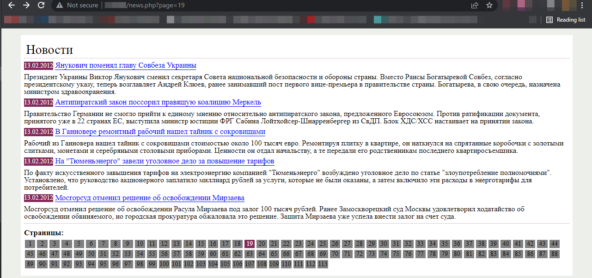
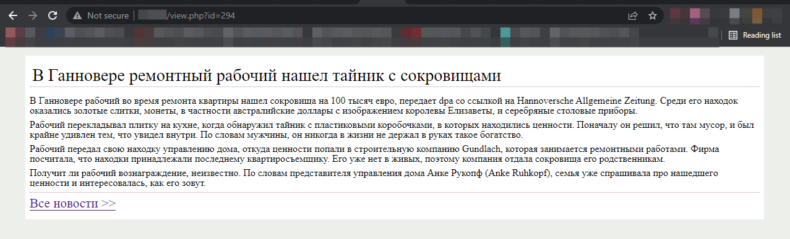

# News displaying built with MVC

## News page

## View article page

## Setup
**With Make**

To start the project you can just go to the project root directory and in terminal run `make all`.

**With Docker**

All you have to do is to run in your terminal(while being in the project root folder) `docker-compose build && docker-compose up`.
Also can use `docker-compose up -d` to run in detached mode (without live logs).

_Note_ : configure your server settings in `src/app/model.php` in `$connection` variable.

